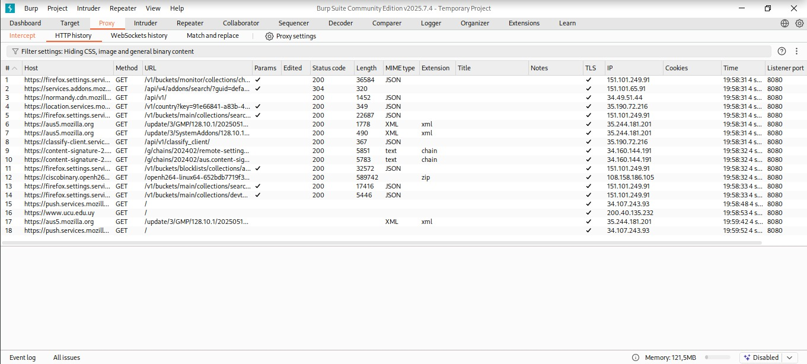

# Desarrollo de Software Seguro

## Índice

- [1. Instalación de Kali Linux en VirtualBox](#1-instalación-de-kali-linux-en-virtualbox)
- [2. Instalación de un Proxy de Interpretación (burpsuite)](#2-instalación-de-un-proxy-de-interpretación-burpsuite)
- [3. Instalación de Visual Studio Code](#3-instalación-de-visual-studio-code)
- [4. Instalación de Docker](#4-instalación-de-docker)
- [5. Ejecución de OWASP Juice Shop en Docker](#5-ejecución-de-owasp-juice-shop-en-docker)
- [6. Ejecución de crAPI en Docker](#6-ejecución-de-crapi-en-docker)
- [7. Prueba de la visualización del tráfico en el proxy de interceptación con Burp Suite](#7-prueba-de-la-visualización-del-tráfico-en-el-proxy-de-interceptación-con-burp-suite)

## 1. Instalación de Kali Linux en VirtualBox

1. Descargar VirtualBox desde [https://www.virtualbox.org/wiki/Downloads](https://www.virtualbox.org/wiki/Downloads) y seguir el instalador correspondiente al sistema operativo host.

2. Descargar la ISO de Kali Linux desde [https://www.kali.org/get-kali/#kali-virtual-machines](https://www.kali.org/get-kali/#kali-virtual-machines) (opción VirtualBox).

3. Crear una nueva máquina virtual en VirtualBox y nombrarla según preferencia.

4. Seleccionar la **Imagen ISO de Kali Linux** en la sección *"ISO image"*.

5. Especificar los recursos de la máquina virtual:
   - **Memoria RAM:** mantener el valor predeterminado o ajustar según disponibilidad.
   - **Número de CPUs:** mantener valor predeterminado.
   - **Tamaño del disco duro:** mantener valor predeterminado o ajustar según necesidad.

6. Finalizar la configuración e iniciar la máquina virtual.

7. Seguir los pasos del instalador de Kali Linux para completar la instalación.

      7.1. Iniciar Instalación
      - Ejecutar el instalador de Kali Linux con la opción **Graphical Install**.
      
      7.2. Seleccionar Idioma
      - Elegir **Español**.
      
      7.3. Seleccionar Ubicación
      - Elegir tu ubicación geográfica.
      
      7.4. Configuración de Teclado
      - Seleccionar **Latinoamericano**.
      
      7.5. Configuración de Usuario
      - Nombre completo: `Nombre completo`
      - Nombre de usuario: `nombre` (ejemplo)
      - Ingresar contraseña segura
      
      7.6. Configuración de Red
      - Dirección IP: `0.2.15` (ejemplo, según tu red)
      - Configurar según necesidad de la red local
      
      7.7. Particionado del Disco
      - Método: **Utilizar todo el disco (Guiado)**
      - Elegir la opción recomendada
      - Cuando se pregunte si deseas formatear el disco: **Sí**
      - Continuar con todas las configuraciones predeterminadas
      
      7.8. Finalizar Instalación
      - Una vez completada, el sistema se reiniciará
      - En la pantalla de inicio, seleccionar: **Kali GNU/Linux**
      - Ingresar **nombre de usuario** y **contraseña** creados previamente

## 2. Instalación de un Proxy de Interpretación (burpsuite)

   1. Abrir la Terminal en Linux
   
   2. Dentro de la terminal ingresar:
   ```bash
sudo apt update && sudo apt upgrade -y
sudo apt install burpsuite -y
   ```

   3. Una vez instalado revisar con el comando:
   ```bash
zaproxy --version
   ```

## 3. Instalación de Visual Studio Code

   1. Descargar Visual Studio Code para Linux desde "https://code.visualstudio.com/docs/setup/linux" (El archivo se llama ".deb.package (64-bit)")

   2. Dentro de la terminal ingresa los siguientes comandos 
   ```bash
cd Descargas
sudo dpkg -i code_1.103.2-1755709794_amd64.deb
   ```

(El nombre puede variar segun la descarga en caso de no funcionar copien y pegen el nombre del archivo en la terminal "sudo dpkg -i nombre_archivo")

## 4. Instalación de Docker

   1. Actualizar los repositorios
      
   ```bash
   sudo apt update
   ```

   2. Instalar Docker (En caso de no funcionar agrega al final del comando "--fix-missing") 
   ```bash
   sudo apt install -y docker.io 
   ```

   3. Habilitar y arrancar el servicio de Docker
   ```bash
   sudo systemctl enable docker --now
   ```

   4. Una vez instalado revisar con el comando:
   ```bash
   docker --version
   ```

## 5. Ejecución de OWASP Juice Shop en Docker

   1. Ejecutar el siguiente comando en la terminal:
   ```bash
   docker run --rm -p 3000:3000 bkimminich/juice-shop
   ```

   2. Verificar que el contenedor funciona correctamente accediendo a la página levantada localmente http://localhost:3000

## 6. Ejecución de crAPI en Docker

   1. Abrir una nueva terminal
   
   2. Ejecutar los siguientes comandos en la terminal:
   ```bash
   git clone https://github.com/OWASP/crAPI.git
   cd crAPI/deploy/docker
   docker-compose up
   ```

   3. Abre tu navegador y accede a http://localhost:8888 

   **Nota:** Si el puerto cambia por algún motivo, abre una nueva terminal y ejecuta:

   ```bash
   sudo docker ps
   ```

   Revisa la columna PORTS de la imagen crapi/crapi-web y reemplaza el número de puerto en la URL según corresponda.

   4. Dentro de la página encontrarás el formulario de inicio de sesión. Desde allí podrás crear una cuenta y acceder al sistema.

## 7. Prueba de la visualización del tráfico en el proxy de interceptación con Burp Suite

1. abrir Burp Suite, desde la terminal:
   ```bash
   burpsuite
   ```
   o desde el menú de aplicaciones.

2. *Configurar el navegador en *Settings 
   - Abrir el navegador (Firefox/Chrome).
   -en este caso usaremos Firefox  
   - Ir a settings > Network Settings > Settings...
     - *Servidor proxy HTTP:* 127.0.0.1  
     - *Puerto:* 8080  
     - Habilitar opción de usar el mismo proxy para todos los protocolos.

3. *Prender la interceptación en Burp (pestaña Proxy)*  
   - Abrir Burp Suite.  
   - Ir a la pestaña *Proxy > Intercept*.  
   - Habilitar la opción *Intercept is on*.  

4. *Descargar el certificado de Burp* 
   - En el navegador, viajar a la URL:  
     
     http://localhost:8080/
       
   - Hacer clic en el enlace *CA Certificate* para descargar el certificado cacert.der. 

5. *Importar el certificado en el navegador*  
   - Ir a Settings > Certificates > View Certificates.  
   - Seleccionar *Importar* y cargar el archivo cacert.der.  
   - Marcar la casilla para *Confiar en este certificado para identificar sitios web*.  

6. *Navegar a un sitio web para probar la interceptación*  
   - En el navegador, visitar cualquier sitio web (por ejemplo, http://google.com o https://ucu.edu.uy).



### Integrantes

- Juan Martínez

- Agustín Schlechter

- Joaquín Viola
